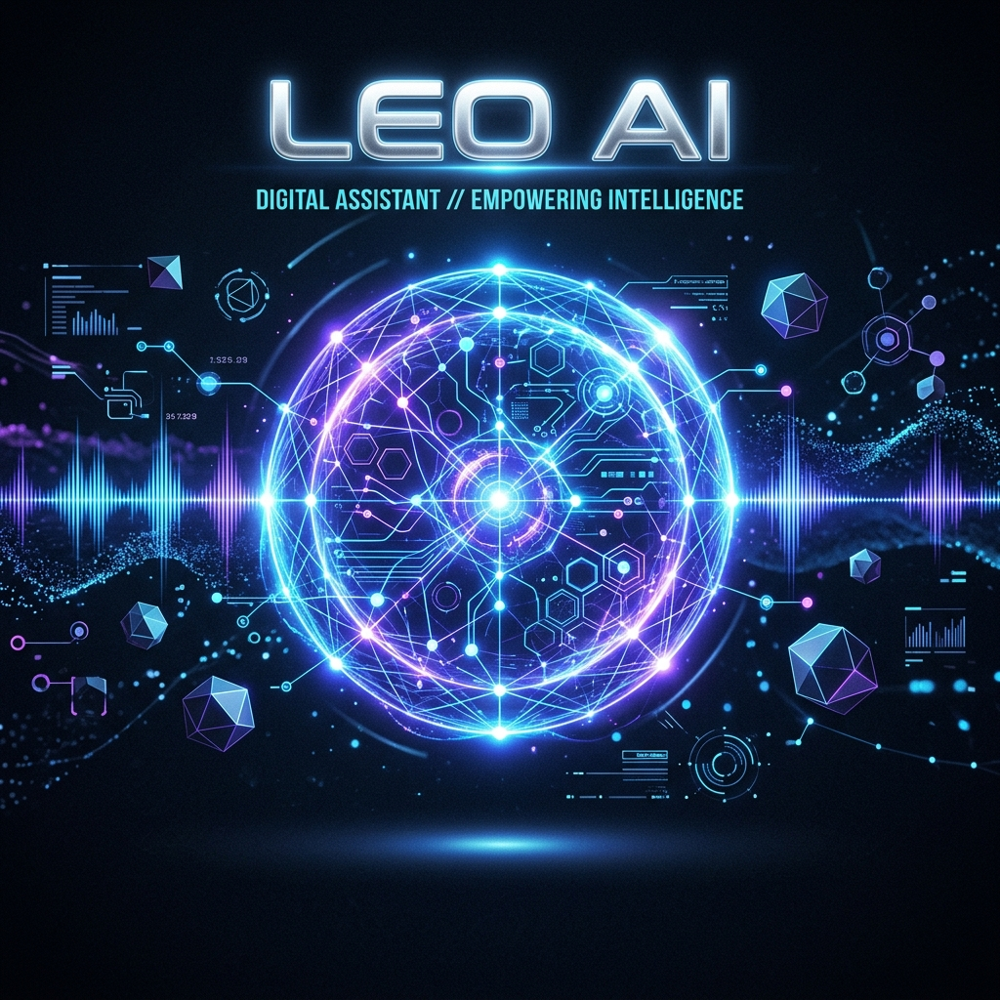
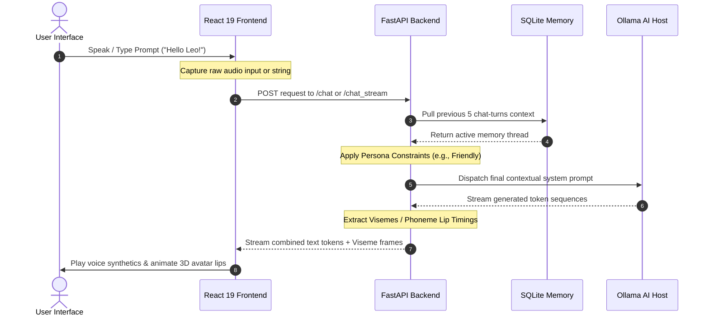

<div align="center">
  
  
  # 🔮 LEO AI - Offline Personal Assistant

  ### *A fully offline, privacy-first desktop AI companion featuring state-of-the-art voice interaction, real-time 3D avatar lip-sync, Stable Diffusion image generation, and intelligent memory systems.*

  <br>

  [](https://ollama.com)
  [](https://fastapi.tiangolo.com)
  [](https://react.dev)
  [](https://threejs.org)
  
  [](#data-privacy--security)
  [](#gpu-acceleration)
  [](#license)

  ---
  
  [🚀 Quick Start](#-quick-start) • [🏗️ Architecture](#-system-architecture) • [🎮 Features](#-key-features) • [⚡ Performance](#-hardware--performance-tiers) • [⚙️ Configuration](#-configuration) • [🛠️ Troubleshooting](#-troubleshooting--status-dashboard)
</div>

<br>

---

## 🎭 Meet Leo: Your Cybernetic Companion

<p align="center">
  
</p>

> [!NOTE]
> **LEO AI** operates as a fully closed-loop ecosystem. Zero telemetry, zero external cloud dependencies, and zero web data transfers. Every audio frame spoken, every prompt analyzed, and every pixel rendered happens entirely on your local machine's processor and graphics memory.

---

## 🎮 Key Features

| Feature | Visual Icon | Technical Implementation | Highlights |
| :--- | :---: | :--- | :--- |
| **Speech Recognition** | 🗣️ | **OpenAI Whisper AI (74MB base)** | Local real-time audio transcriptions with `<1 second` processing latency. |
| **Voice Synthesis** | 🔊 | **eSpeak-NG Engine + Phonemes** | High-speed, responsive local text-to-speech with organic output matching. |
| **Interactive 3D Avatar** | 🤖 | **Three.js + React Three Fiber + VRM** | Realistic lip-sync animation dynamically driven by phoneme extraction. |
| **Creative Generation** | 🎨 | **Stable Diffusion (segmind/small-sd)** | High-fidelity offline image generation (takes `30-60s` on CPU/GPU). |
| **Cognitive Memory & RAG** | 🧠 | **SQLite + ChromaDB Embeddings** | Remembers conversation context, recall histories, and indexes local docs. |
| **Multilingual Engine** | 🌍 | **Auto-Language Classifier** | Full native support for **Telugu** 🇮🇳, Hindi, Tamil, English, and 10+ others. |

---

## 🏗️ System Architecture

Leo AI uses a decoupled, high-performance local web architecture to stream inference updates instantaneously.

```mermaid
graph TD
    classDef frontend fill:#00d2ff,stroke:#005c8a,stroke-width:2px,color:#000;
    classDef backend fill:#8a2be2,stroke:#4b0082,stroke-width:2px,color:#fff;
    classDef models fill:#32cd32,stroke:#006400,stroke-width:2px,color:#fff;
    classDef storage fill:#ff8c00,stroke:#8b0000,stroke-width:2px,color:#fff;

    subgraph User Interface Layer
        UI["💻 Desktop App (PyWebView) / Browser"]:::frontend
    end

    subgraph Frontend Engine (Port 5173)
        R19["⚛️ React 19 Application"]:::frontend
        TJS["🎮 Three.js Viseme Lip-Sync"]:::frontend
        FMO["✨ Framer Motion UI Animations"]:::frontend
    end

    subgraph Backend Core (Port 8000)
        FAS["⚡ FastAPI Web Framework"]:::backend
        PHO["🎙️ Phoneme Extractor Engine"]:::backend
        RAG["📁 ChromaDB Document Indexer"]:::backend
        PER["🎭 Dynamic Persona Manager"]:::backend
    end

    subgraph AI Model Host (Port 11434)
        OLL["🧠 Ollama Inference Core"]:::models
        SDM["🎨 Stable Diffusion Generator"]:::models
    end

    subgraph Local Storage & Cache
        SQL["💾 memory.db (SQLite)"]:::storage
        VEC["🗂️ Vector Embeddings Cache"]:::storage
    end

    UI <--> R19
    R19 <--> TJS
    R19 <--> FMO
    R19 <-->|REST / WebSockets| FAS
    FAS <--> PHO
    FAS <--> RAG
    FAS <--> PER
    FAS <-->|Local Host Loop| OLL
    FAS <-->|Pytorch Pipeline| SDM
    FAS <--> SQL
    RAG <--> VEC
```

### 🔁 Deep Dive Request-Response Data Flow



---

## ⚡ Hardware & Performance Tiers

Leo is highly scalable and automatically calibrates its performance profiles depending on your available hardware assets:

| Spec Tier | Target Models | RAM Needed | GPU Recommendation | Response Latency |
| :---: | :--- | :---: | :---: | :---: |
| **🚀 Ultra (High-End)** | `phi3:mini` (2.2GB) / `Expert Mode` | **16 GB+** | NVIDIA RTX 40-Series (CUDA active) | **1.0s - 1.5s** |
| **⚖️ Balanced (Mid-Range)** | `llama3.2:1b` (1.3GB) | **8 GB** | Integrated GPU / NVIDIA GTX | **2.0s - 3.5s** |
| **🍃 Eco (Low-End / CPU)** | `tinyllama:latest` (637MB) | **4 GB** | Pure CPU Execution | **3.0s - 5.0s** |

---

## 🚀 Quick Start

### 📋 Prerequisites
Ensure your developer machine has the following frameworks installed:
- **Python 3.11+**
- **Node.js 18+**
- [Ollama App](https://ollama.com/) (running in the background)
- **NVIDIA GPU drivers** (Optional: CUDA 11.8+ for ultra hardware acceleration)

---

### 📥 Step-by-Step Installation

#### 1. Setup local AI Models
Launch your local terminal shell and pull the optimized model files:
```bash
# Pull lightweight models
ollama pull phi3:mini
ollama pull llama3.2:1b
ollama pull tinyllama
```

#### 2. Initialize the Python FastAPI Backend
```bash
# Enter backend path
cd backend

# Create & activate a sandbox environment
python -m venv venv
venv\Scripts\activate

# Install requirements
pip install -r requirements.txt
```

#### 3. Build Node.js Package Dependencies
```bash
# Navigate to UI frontend
cd ../frontend

# Download packages
npm install
```

---

### 🔌 Running & Stopping Leo AI

We have provided automated control scripts in the project root path for ease of access:

#### ⚡ Start all services:
Double-click `START.bat` or run:
```bash
./START.bat
```
*This starts the backend FastAPI endpoint at http://localhost:8000 and the React dev environment at http://localhost:5173.*

#### 🛑 Stop all services:
Double-click `STOP.bat` or run:
```bash
./STOP.bat
```
*This gracefully tears down all running background port servers, freeing up your RAM and GPU VRAM safely.*

---

## ⚙️ Configuration

Custom parameters can be easily adjusted by editing the local `backend/.env` file:

```env
# Host Configurations
HOST=127.0.0.1
PORT=8000

# Active AI Inference Models
FAST_MODEL=llama3.2:1b         # Quick responses, conversational mode
EXPERT_MODEL=phi3:mini          # Multi-lingual translation, logic tasks

# Generative Settings
TEMPERATURE=0.85                # Scale from 0.0 (precise) to 1.0 (creative)

# Hardware Control
CUDA_ENABLED=true               # Set to 'false' if running on a non-NVIDIA system
```

---

## 🧠 Customizing Leo

### 🇮🇳 Telugu & Multi-Lingual Support
Leo auto-detects Romanized and Native scripts on the fly.
* **Native:** *"నమస్కారం, మీరు ఎలా ఉన్నారు?"*
* **Romanized:** *"Namaskaram, meeru ela unnaru?"*

To adjust language regex anchors, modify [language_detector.py](file:///c:/Users/bhaskar/Desktop/final%20sv%20llm/bobmarleyy/backend/core/language_detector.py).

### 🎭 Personalities
You can change the character prompts (e.g., Friendly, Professional, Sarcastic) by adding schemas to [personality_manager.py](file:///c:/Users/bhaskar/Desktop/final%20sv%20llm/bobmarleyy/backend/core/personality_manager.py).

---

## 🛠️ Troubleshooting & Status Dashboard

Before launching, you can run an automatic hardware & system sanity test using the integrated check tool:
```bash
cd backend
venv\Scripts\python.exe ..\tests\test_system.py
```

### 🔍 Quick Fixes

> [!TIP]
> **NumPy / Package Warning:** If the backend prints warnings about NumPy compatibility, ensure your activated venv matches the fixed requirements version (`numpy==1.26.4`).

> [!WARNING]
> **Image Generation Fails:** The very first image generated triggers a download of the Stable Diffusion model (`~1.2GB`). Ensure your network is active during the first request, and that you have at least 4GB of free local disk space.

> [!IMPORTANT]
> **Voice Synthesizer Offline:** Ensure eSpeak-NG is installed and added to your system Environment variables (`PATH`) so that the audio pipeline can translate written words to viseme schedules successfully.

---

## 📂 Project Directory Structure

```
bobmarleyy/
├── backend/                  # FastAPI + Python Engine
│   ├── core/                # Brain systems (RAG, Memory, Language)
│   ├── services/            # Pipelines (Audio, SD Images, Visemes)
│   ├── routes/              # FastAPI Router Interfaces
│   └── main.py              # Application main entry point
├── frontend/                 # React 19 + Three.js Client
│   ├── src/                 # Client source code
│   │   ├── components/      # UI Elements, Avatar 3D Scene
│   │   └── views/           # ChatView, SettingsView, StatsView
│   └── package.json         # Node manifest
├── docs/                     # Comprehensive System Documentation
│   ├── images/              # Custom Generated UI Artwork & Assets
│   └── ARCHITECTURE.md      # Under-the-hood systems specifications
├── tests/                    # Multilingual & Generator Test suites
├── START.bat                 # Orchestrates entire local launch
└── STOP.bat                  # Tears down port processes gracefully
```

---

<div align="center">
  <h3>🔒 100% Secure • 🔒 100% Local • 🔒 100% Private</h3>
  
  **Version 1.0.0 (Production Ready)** • Designed with ❤️ for Offline AI Companions.
</div>
