# LEO AI - Technology Stack & Architecture Reference

LEO AI is built entirely as a **closed-loop, privacy-first offline ecosystem**. By decoupling the high-performance Python FastAPI backend from the React 19 / Three.js frontend, the system delivers real-time voice, 3D graphics, and machine learning models with zero external cloud dependencies.

---

## 🏗️ System Topology & Dataflow

```mermaid
graph TD
    classDef client fill:#00dbff,stroke:#00a3c2,stroke-width:2px,color:#000;
    classDef server fill:#8a2be2,stroke:#5c00a3,stroke-width:2px,color:#fff;
    classDef ml fill:#32cd32,stroke:#1f7a1f,stroke-width:2px,color:#fff;
    classDef db fill:#ff8c00,stroke:#b36200,stroke-width:2px,color:#fff;

    subgraph Client_Side ["User Interface & 3D Layer (React 19)"]
        Vite["Vite Build Tool"]:::client
        Three["Three.js / React Three Fiber"]:::client
        VRM["@pixiv/three-vrm (3D VRM Avatar)"]:::client
        MediaPipe["MediaPipe Hands (Gesture Control)"]:::client
        PWA["Vite PWA (Offline Desktop Client)"]:::client
    end

    subgraph Server_Side ["Core Business Logic (FastAPI)"]
        FastAPI["FastAPI Web Framework"]:::server
        Uvicorn["Uvicorn ASGI Web Server"]:::server
        Scheduler["Scheduler Service (Apscheduler)"]:::server
    end

    subgraph ML_Side ["Offline AI & Inference Core"]
        Ollama["Ollama Engine (phi3:mini / Llama 3.2)"]:::ml
        Whisper["OpenAI Whisper (Speech-to-Text)"]:::ml
        eSpeak["eSpeak-NG (Phonetics Extraction)"]:::ml
        Diffusers["Stable Diffusion (segmind/small-sd)"]:::ml
    end

    subgraph Storage_Side ["Local Persistence Layer"]
        SQLite["memory.db (Conversations Storage)"]:::db
        FTS5["SQLite FTS5 (BM25 Ranked RAG Index)"]:::db
    end

    Vite --> Three
    Three --> VRM
    Vite --> MediaPipe
    Vite --> PWA

    Vite -->|REST / HTTP WebSockets| FastAPI
    FastAPI --> Scheduler
    
    FastAPI --> SQLite
    FastAPI --> FTS5
    
    FastAPI --> Ollama
    FastAPI --> Whisper
    FastAPI --> eSpeak
    FastAPI --> Diffusers
```

---

## 💻 Frontend Technology Stack

| Domain | Technology / Library | Version / Scope | Purpose & Implementation |
| :--- | :--- | :---: | :--- |
| **Client Core** | **React** | `^19.2.4` | Modern component UI architecture and state hooks. |
| **Build & Dev** | **Vite** | `^8.0.1` | Instant hot module replacement (HMR) and production bundling. |
| **3D Graphics** | **Three.js** | `^0.183.2` | Rendering WebGL contexts and 3D scenes. |
| **R3F Layer** | **React Three Fiber** | `^9.5.0` | Declarative, reactive component bindings for Three.js. |
| **VRM Loader** | **`@pixiv/three-vrm`** | `^3.5.1` | Importing and animating skeletal `.vrm` standard avatar nodes. |
| **Lip-Syncing** | **Custom Viseme Hook** | *Internal* | Syncs character boundaries and morph targets on the mouth dynamically. |
| **Animations** | **Framer Motion** | `^11.11.1` | Rich micro-interactions and transitions for dashboard panels. |
| **Vision AI** | **MediaPipe Hands** | `^0.4.16` | Fully local camera-based gesture recognition (waves, thumbs, fists). |
| **Offline App** | **`vite-plugin-pwa`** | `^1.2.0` | Desktop packaging, progressive assets caching, and custom launch handles. |

---

## ⚡ Backend Technology Stack

| Domain | Technology / Library | Version / Scope | Purpose & Implementation |
| :--- | :--- | :---: | :--- |
| **API Framework** | **FastAPI** | `^0.110.0` | Asynchronous routes mapping, automated Pydantic schema validation. |
| **ASGI Engine** | **Uvicorn** | `^0.28.0` | Asynchronous ASGI network loops serving port `8000`. |
| **AI LLM Core** | **Ollama Engine** | `Local Host` | Offline host orchestration (phi3:mini / Llama 3.2 1b / TinyLlama fallback). |
| **Transcription** | **OpenAI Whisper** | `base` | Local spectrogram transcribing (loaded directly via `soundfile`/`librosa`). |
| **Image Gen** | **Hugging Face `diffusers`**| `0.25.0` | Offline image generation using optimized model `segmind/small-sd`. |
| **Compute / Math** | **PyTorch & NumPy** | `2.11.0` / `1.26.4`| CUDA & CPU tensor computations for offline transformers. |
| **Voice Phonemes**| **eSpeak-NG Engine** | `Subprocess` | Extracts precise phonetic syllables dynamically mapped to avatar mouth visemes. |
| **RAG Vector Search**| **SQLite FTS5** | `Standard Lib` | BM25-ranked persistent full-text indexing with query term sanitization. |
| **History Database**| **SQLite3** | `Standard Lib` | Storage schema retaining conversation turns and persona histories. |

---

## 🔒 Offline System Safety Controls

To secure processing boundaries, the following configurations are programmatically enforced:
1. **Zero External Requests:** All routes (Whisper STT, FTS5 RAG, stable diffusion generation) execute inside the local runtime.
2. **CORS Isolation:** CORS is configured explicitly to secure local cross-origin communications.
3. **Pipelined WAV Handlers:** Audio streams are parsed directly from memory array buffers via `soundfile`, bypassing `ffmpeg` dependencies.
